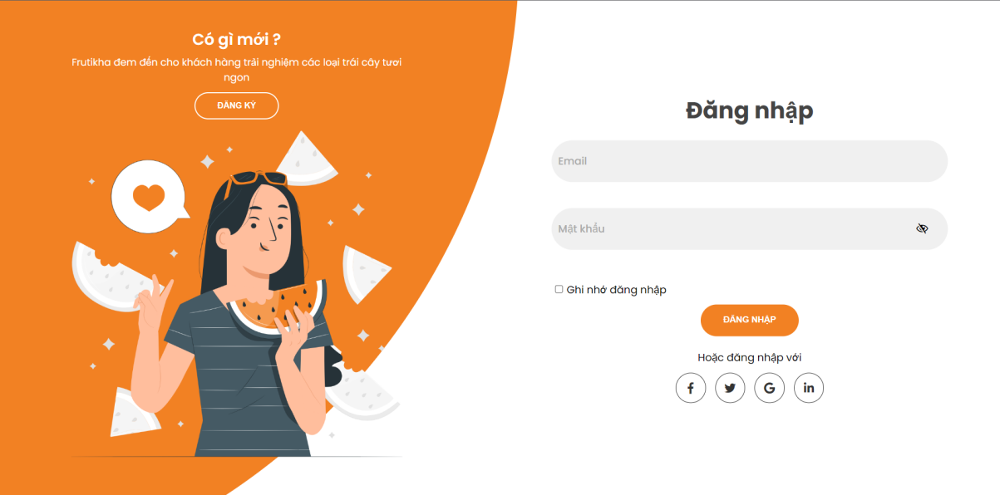
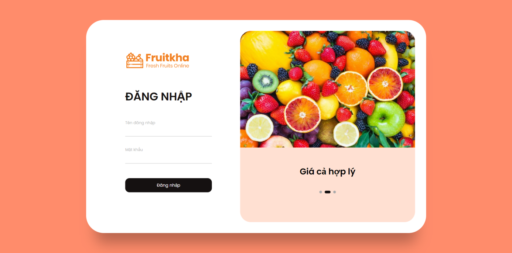
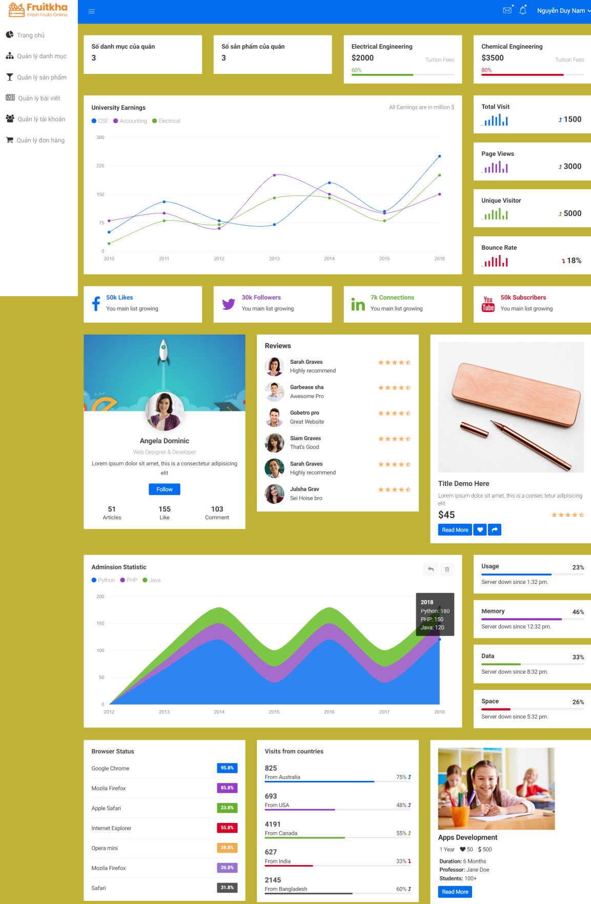
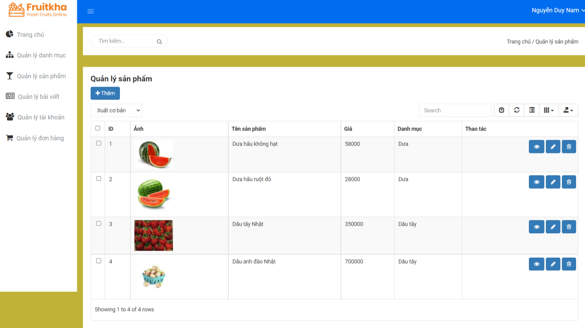

# frutika

This is a fruit-selling project written in PHP and the database used is MySQL.

---

# customer screens

- Some of screens customer

[See more](document/img_screens/customer.md)

---

# admin screens

- Some of screens admin

[See more](document/img_screens/admin.md)

